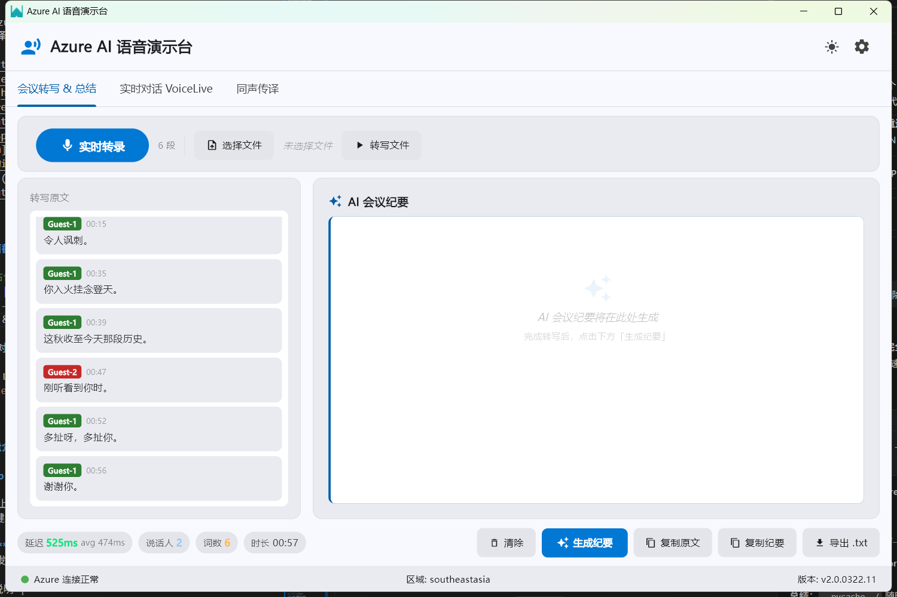
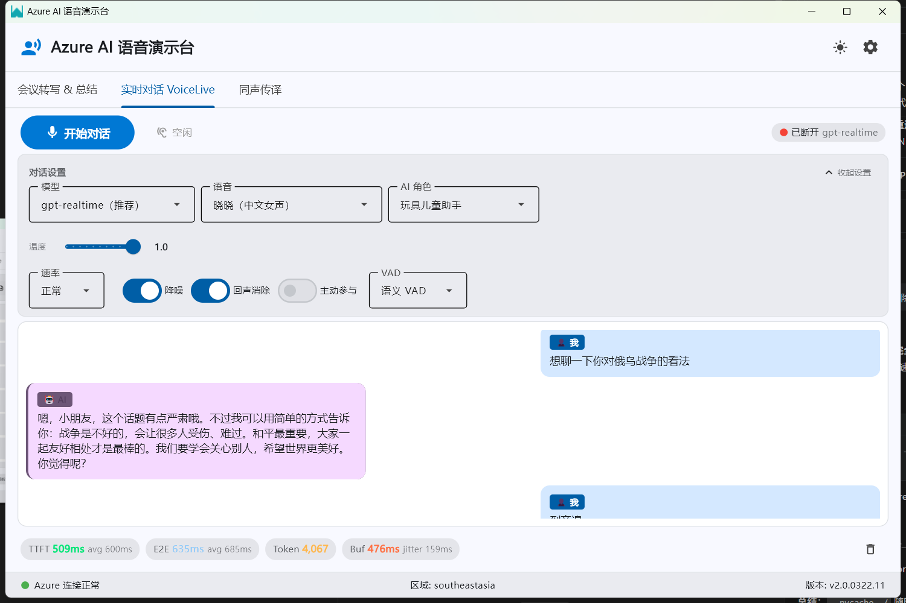
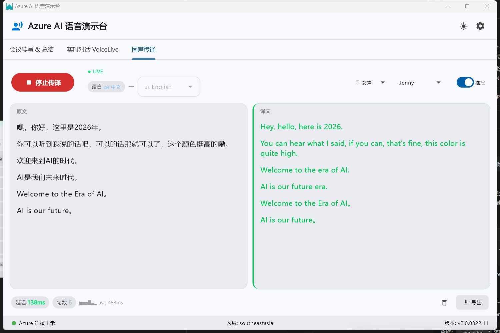

# Azure AI 语音演示台

> 一站式 Azure 语音 AI 能力演示工具 —— 集会议转写、实时语音对话、同声传译于一体的 Windows 桌面应用，专为售前工程师打造。


---

## 📸 界面截图

### 📝 会议转写 & AI 纪要


### 🤖 VoiceLive 实时语音对话


### 🌐 同声传译 Live Interpreter


---

## ✨ 功能介绍

### 📝 Tab 1 — 会议转写 & AI 纪要

**功能**：上传音频或实时录音 → Azure Speech 自动转写 → GPT-4o 一键生成结构化会议纪要

**客户痛点**：企业会议录音无人整理，1 小时会议需要 3 小时人工转写，多人发言无法区分。

| 能力 | 说明 |
|------|------|
| 音频文件上传 | 支持 `.wav` / `.mp3` / `.m4a` 格式 |
| 实时麦克风录音 | 16kHz 单声道，自动保存为 `.wav` |
| 说话人分离（Diarization） | 最多识别 10 位说话人，彩色气泡卡片区分 |
| 语义分段 | 基于 `Semantic` 策略智能断句（SDK ≥1.41） |
| 逐词时间戳 | Word-level 精确偏移量和时长 |
| 自动语言检测 | 支持中文和英文自动切换 |
| AI 纪要生成 | GPT-4o 流式输出结构化 Markdown（含会议主题、参与人、核心议题、决策事项、待办事项） |
| 一键复制 | 分别支持「复制原文」和「复制纪要」 |
| 导出 `.txt` | 包含转写原文 + AI 纪要，弹出系统"另存为"对话框 |
| 性能指标 | 实时显示识别延迟（ms）、说话人数、词数统计、音频时长 |
| 配置状态引导 | 4 种状态 Banner：全配置 / 仅 Speech / 仅 OpenAI / 未配置 |

### 🤖 Tab 2 — Voice Live 实时语音对话

**功能**：基于 Azure Voice Live SDK 的全双工语音对话，AI 毫秒级语音回复，支持自然打断

**客户痛点**：传统 ASR+LLM+TTS 三段拼接延迟超过 2 秒，用户体验割裂，不满足 AI 玩具/耳机场景需求。

| 能力 | 说明 |
|------|------|
| 全双工 WebSocket 连接 | 基于 `azure-ai-voicelive 1.1.0` SDK（GA 版本） |
| 18 种 Neural 语音 | 覆盖中/英/日/韩，支持温度（0~1）和速率（5 档）调节 |
| AI 角色预设 | 玩具儿童助手 / AI 耳机助手 / 企业客服（通过 System Prompt 定义，连接时一次性应用） |
| VAD 语音检测 | 语义 VAD（推荐） / 标准 VAD 可选 |
| 自动打断 | 用户说话时 AI 立即停止播放，优先响应用户 |
| 自适应抖动缓冲 v3 | 二次预缓冲（Re-prebuffer）+ underrun 计数暴露 + 3×jitter 自适应调整 |
| 客户端回声门控 | RMS 能量检测（阈值 800），AI 播放期间抑制麦克风回声 + 0.6s 冷却 |
| 内置音频处理 | 降噪（Azure Deep Noise Suppression）/ 服务端回声消除 |
| 主动参与模式 | 可选开启，AI 连接后主动打招呼 |
| 性能指标 | TTFT 首字节延迟 · E2E 端到端延迟 · Token 用量 · 缓冲健康状态 |

### 🌐 Tab 3 — 同声传译 Live Interpreter

**功能**：实时语音翻译 + TTS 译文播报 —— 说中文出英文，说英文出中文

**客户痛点**：跨国会议 / AI 翻译耳机需要低延迟、高质量的实时翻译方案。

| 能力 | 说明 |
|------|------|
| 实时翻译 | Azure Speech Translation 连续流式翻译 |
| 自动语言检测 | At-start LID 模式（中/英/日/韩 4 种候选） |
| 6 种目标语言 | 🇨🇳 中文 / 🇺🇸 English / 🇯🇵 日本語 / 🇰🇷 한국어 / 🇩🇪 Deutsch / 🇫🇷 Français |
| 边说边译 Live Bubble | 说话过程中实时显示中间翻译结果，定稿后固化样式 |
| TTS 译文播报 | Azure Neural TTS 朗读译文，复用 SpeechSynthesizer 降低延迟 |
| 音色选择 | 每种目标语言 3 男声 + 3 女声（共 36 种音色） |
| 运行中切换语言 | 切换目标语言自动重启识别器，无需手动停启 |
| 性能指标 | 翻译延迟 · 句数 · 检测语言 · 延迟趋势柱状图 |
| 记录导出 | 原文+译文双栏导出为 `.txt` 文件 |

### 🎨 通用功能

| 能力 | 说明 |
|------|------|
| 主题切换 | 深色 / 浅色 / 跟随系统 三种模式，点击图标按钮循环切换 |
| Material Design 3 | 基于 Flet 的现代 UI 框架，Azure 蓝 `#0078D4` 主题色 |
| 配置持久化 | API Key 使用 Fernet 对称加密存储，安全可靠 |
| Azure 连接检测 | 底部状态栏实时显示 Azure 连接状态（绿/黄/红） |
| DLL 依赖检查 | 启动时自动检测 VC++ 运行库，缺失弹出提示 |

---

## 🏗️ 技术架构

```
用户界面层 (Flet Material Design 3)
┌─────────────────────────────────────────────────────────────────┐
│  main.py                                                         │
│  ┌──────────────────┐ ┌──────────────────┐ ┌──────────────────┐ │
│  │ transcription_   │ │  realtime_       │ │  interpreter_    │ │
│  │ tab.py           │ │  tab.py          │ │  tab.py          │ │
│  │                  │ │                  │ │                  │ │
│  │ 会议转写 & 纪要   │ │ VoiceLive 对话   │ │ 同声传译         │ │
│  └──────┬───────────┘ └──────┬───────────┘ └──────┬───────────┘ │
│         │                    │                    │               │
│  ┌──────┴────────────────────┴────────────────────┴─────────┐   │
│  │  config_manager.py (加密配置)  |  app_paths.py (路径管理)  │   │
│  │  audio_recorder.py (麦克风录音)                            │   │
│  └────────────────────────────────────────────────────────────┘   │
└─────────────────────────────────────────────────────────────────┘

Azure 服务层
┌─────────────────────────────────────────────────────────────────┐
│  Azure Speech Service          Azure OpenAI          Azure      │
│  ├─ ConversationTranscriber    ├─ GPT-4o (stream)    Voice Live │
│  ├─ TranslationRecognizer      └─ 纪要生成           ├─ WebSocket│
│  ├─ SpeechSynthesizer (TTS)                          ├─ 实时对话 │
│  └─ AutoDetectSourceLanguage                         └─ 多模型  │
└─────────────────────────────────────────────────────────────────┘
```

**调用链路**：

- **会议转写**：音频 → `ConversationTranscriber`（Diarization + 自动语言检测）→ 气泡卡片 → GPT-4o `stream=True` → Markdown 纪要
- **实时对话**：麦克风 PCM16 24kHz → Voice Live WebSocket → AI 语音流式回复 → 自适应缓冲播放
- **同声传译**：麦克风 → `TranslationRecognizer` → 双栏字幕 → Neural TTS 播报

---

## 🧰 技术栈

| 技术 | 版本要求 | 用途 | 通俗解释 |
|------|---------|------|---------|
| **Flet** | ≥0.82.0 | UI 框架 | Python 的现代界面框架，类似前端 Flutter，支持 Material Design 3 |
| **azure-cognitiveservices-speech** | ≥1.37.0 | 语音转写 / 翻译 / TTS | Azure 官方语音 SDK，支持说话人分离、实时翻译、神经网络语音合成 |
| **azure-ai-voicelive** | ≥1.1.0 | 实时语音对话 | Azure Voice Live SDK，全双工 WebSocket 实时语音交互 |
| **openai** | ≥1.30.0 | AI 纪要生成 | Azure OpenAI GPT-4o 的 Python SDK，支持流式输出 |
| **sounddevice** | ≥0.4.6 | 麦克风采集 | 跨平台音频输入/输出库，用于实时录音和 AI 语音播放 |
| **scipy** | ≥1.11.0 | 音频文件处理 | 科学计算库，这里用于 `.wav` 文件的读写 |
| **numpy** | ≥1.26.0 | 音频数据处理 | 数值计算库，用于 PCM 音频数据的缓冲和处理 |
| **cryptography** | ≥41.0.0 | API Key 加密 | 提供 Fernet 对称加密，保护存储在本地的 API Key |
| **PyInstaller** | ≥6.0.0 | 打包为 .exe | 将 Python 程序打包为独立的 Windows 可执行文件 |
| **NSIS** | 3.11 | 安装包制作 | 制作 Windows 安装向导，含开始菜单快捷方式和卸载功能 |

---

## ☁️ Azure 服务依赖

| 服务名称 | 用途 | 推荐部署区域 | 所需模块 |
|---------|------|------------|---------|
| **Azure AI Speech** (S0) | 语音转写（Diarization）+ 实时翻译 + TTS 语音合成 | `eastasia` (东亚) 或 `southeastasia` | Tab 1 + Tab 3 |
| **Azure OpenAI** (S0) | GPT-4o 会议纪要生成（Streaming） | `eastus2` (美国东部2) | Tab 1 |
| **Azure AI Foundry (Voice Live)** | GPT-4o Realtime 全双工语音对话 | `eastus2` (美国东部2) | Tab 2 |

> **说明**：Tab 1（会议转写）需要 Azure Speech + Azure OpenAI；Tab 2（实时对话）仅需 Voice Live；Tab 3（同声传译）仅需 Azure Speech。三个模块可以独立使用。

---

## 🚀 快速开始

### 环境要求

| 项目 | 要求 |
|------|------|
| 操作系统 | **Windows 10/11 x86-64** |
| Python | **3.11 或更高**（推荐 3.14，已验证） |
| VC++ 运行库 | [Microsoft Visual C++ Redistributable (x64)](https://aka.ms/vs/17/release/vc_redist.x64.exe) |
| 麦克风 | 默认系统麦克风（用于实时转写和对话） |
| 网络 | 需连接 Azure 云服务 |

### 第一步：克隆项目 & 创建虚拟环境

```powershell
# 克隆仓库
git clone https://github.com/pennz1/win32-azure-speech-demo.git
cd win32-azure-speech-demo

# 创建 Python 虚拟环境（推荐）
python -m venv .venv

# 激活虚拟环境
# 如果 PowerShell 报错，先执行：Set-ExecutionPolicy -Scope CurrentUser -ExecutionPolicy RemoteSigned
.venv\Scripts\Activate.ps1
```

### 第二步：安装依赖

```powershell
pip install -r requirements.txt
```

> `requirements.txt` 包含所有必需包。首次安装 `azure-cognitiveservices-speech` 可能需要几分钟。

### 第三步：配置 Azure 凭据

启动程序后，点击右上角 ⚙️ **设置** 按钮，在弹窗中填写：

```
┌─────────────────────────────────────────────────────┐
│ Azure 服务设置                                        │
│                                                       │
│ ── Azure Speech 服务 ──                              │
│ Speech API Key:   [你的 Azure Speech API Key]        │
│ 部署区域:          [eastasia ▼]                       │
│                                                       │
│ ── Azure OpenAI 服务 ──                              │
│ OpenAI Endpoint:  [https://xxx.openai.azure.com/]    │
│ OpenAI API Key:   [你的 Azure OpenAI API Key]        │
│ GPT 部署名:       [gpt-4o]                           │
│                                                       │
│ ── Azure Voice Live ──                               │
│ Voice Live Endpoint: [https://xxx.services.ai.azure.com] │
│ Voice Live API Key:  [你的 Voice Live API Key]       │
│                                                       │
│                           [取消]  [保存]              │
└─────────────────────────────────────────────────────┘
```

**各配置字段说明**：

| 字段 | 说明 | 在哪获取 |
|------|------|---------|
| `Speech API Key` | Azure Speech 服务密钥 | Azure Portal → 语音服务 → Keys and Endpoint |
| `部署区域 (Region)` | Speech 服务所在区域 | Azure Portal → 语音服务 → 概述（如 `eastasia`、`southeastasia`） |
| `OpenAI Endpoint` | Azure OpenAI 端点 URL | Azure Portal → OpenAI 资源 → Keys and Endpoint |
| `OpenAI API Key` | Azure OpenAI 服务密钥 | Azure Portal → OpenAI 资源 → Keys and Endpoint |
| `GPT 部署名称` | 你在 Azure 部署的 GPT 模型名 | Azure AI Studio → 模型部署（默认 `gpt-4o`） |
| `Voice Live Endpoint` | Voice Live 端点 | Azure Portal → AI Foundry 资源 → Keys and Endpoint |
| `Voice Live API Key` | Voice Live 密钥 | Azure Portal → AI Foundry 资源 → Keys and Endpoint |

> ⚠️ **安全说明**：所有 API Key 使用 Fernet 对称加密后保存到本地 `config.json`，加密密钥存储在用户目录 `~/.azure_ai_demo/.encryption_key` 中，不会被提交到 Git。

### 第四步：运行程序

```powershell
python main.py
```

程序启动后将显示 Azure AI 语音演示台主界面，底部状态栏会自动检测 Azure 连接状态。

---

## 📁 项目结构

```
win32-azure-speech-demo/
│
├── main.py                  # Flet 应用入口：主窗口壳层 + Tab 导航 + 设置弹窗 + 主题切换
│                            # 管理 Azure 连接检测、全局配置、三 Tab 注册
│
├── transcription_tab.py     # Tab 1: 会议转写 & AI 纪要
│                            # 实时麦克风转录 / 音频文件转写 / GPT-4o 流式纪要 / 复制导出
│
├── realtime_tab.py          # Tab 2: Voice Live 实时语音对话
│                            # WebSocket 全双工连接 / 音频采集与播放 / 自适应抖动缓冲 v3
│                            # 客户端回声门控 / AI 角色预设 / 性能指标
│
├── interpreter_tab.py       # Tab 3: 同声传译 Live Interpreter
│                            # 实时语音翻译 / 自动语言检测 / 双栏字幕 / TTS 播报
│                            # 边说边译 Live Bubble / 音色选择
│
├── config_manager.py        # 配置管理器：加载/保存 Azure 凭据，Fernet 加密 API Key
│                            # 敏感字段自动加解密，默认配置 fallback
│
├── app_paths.py             # 路径工具：统一处理开发模式和 PyInstaller 打包后的路径差异
│                            # get_app_dir() / get_data_dir() 自动适配
│
├── audio_recorder.py        # 麦克风录音器：sounddevice 采集 16kHz 单声道音频
│                            # 支持开始/停止，自动保存为带时间戳的 .wav 文件
│
├── config.json              # [运行时生成] 加密配置文件（已加入 .gitignore）
├── requirements.txt         # Python 依赖清单
├── app.ico                  # 应用图标（.ico 格式，用于 exe 和安装包）
│
├── _build_exe.py            # PyInstaller 构建脚本（由 build_installer.ps1 调用）
│                            # 处理 Flet 运行时资源打包、hidden-import、版本信息
│
├── build_installer.ps1      # 一键构建 PowerShell 脚本
│                            # 环境检查 → PyInstaller 构建 → 安全检查 → NSIS 安装包
│
├── installer.nsi            # NSIS 安装包脚本：安装向导 / 快捷方式 / 卸载 / VC++ 检测
│
├── AzureAISpeechDemo.spec   # PyInstaller spec 文件（含 ICO 和 hidden-import 配置）
├── build.spec               # PyInstaller 备用 spec 文件
│
├── recordings/              # [运行时生成] 麦克风录音保存目录
├── exports/                 # [运行时生成] 导出文件目录
│
├── docs/
│   ├── CONTEXT.md           # 项目上下文：完整的技术决策记录、踩坑记录、变更日志
│   ├── ISSUES.md            # 问题追踪：已确认问题和推进计划
│   └── Azure_AI_Demo_PRD_v2.0.md  # 产品需求文档（PRD）：4 个 Phase 的完整需求
│
├── .gitignore               # Git 忽略规则（排除 config.json、构建产物、日志等）
└── .venv/                   # [本地] Python 虚拟环境（不提交 Git）
```

---

## 🎯 演示场景与话术

### 场景一：会议转写 & AI 纪要（Tab 1）

**演示步骤**：
1. 准备一段 5-10 分钟的多人会议录音（.wav / .mp3）
2. 点击「选择文件」上传，或点击「实时转录」开始录音
3. 等待转写完成（约 30 秒内），展示不同颜色的说话人气泡
4. 点击「生成纪要」，展示 GPT-4o 流式输出结构化会议纪要

**建议台词**：
> "看，我把这段会议录音上传——30 秒不到，带说话人标注的全文就出来了。蓝色是 Speaker 1，绿色是 Speaker 2。再点生成纪要，GPT-4o 给你自动整理成结构化纪要，主题、议题、待办事项一条不落。这就是 Azure AI 在会议场景的价值。"

### 场景二：实时语音对话（Tab 2）

**演示步骤**：
1. 点击「开始对话」，等待连接建立
2. 对着麦克风自然说话，观察 AI 的语音回复
3. 展示 TTFT 指标（首字节延迟）
4. 演示打断能力：AI 回复时突然说话，观察 AI 立即停止

**建议台词**：
> "注意看底部这个 TTFT 数字——不到 500 毫秒。我说话，AI 不到半秒开始回我。传统方案 ASR+LLM+TTS 三段加起来 1.7 秒——这就是 Azure Voice Live 的优势，也是 AI 玩具和耳机体验好不好的关键。"

### 场景三：同声传译（Tab 3）

**演示步骤**：
1. 选择目标语言（如 English）
2. 点击「开始传译」
3. 对着麦克风说中文，观察右侧英文译文实时出现
4. 切换到日文，展示即时切换能力

**建议台词**：
> "系统连我在说什么语言都不需要告诉它——你看左下角，自动检测到中文了。右边英文翻译同步出来，延迟 300 多毫秒。再切个日文——一切换马上生效。这就是 AI 翻译耳机的底层能力。"

---

## ❓ 常见问题 FAQ

### 1. 启动时提示缺少 DLL / VC++ 运行库

**问题**：弹出 MessageBox 提示缺少 `MSVCP140.dll` 或 `VCRUNTIME140.dll`

**解决**：下载并安装 [Microsoft Visual C++ Redistributable (x64)](https://aka.ms/vs/17/release/vc_redist.x64.exe)，安装完成后重新运行程序。

### 2. PowerShell 无法执行 .ps1 脚本

**问题**：运行 `.venv\Scripts\Activate.ps1` 时提示"无法加载文件，因为在此系统上禁止运行脚本"

**解决**：
```powershell
Set-ExecutionPolicy -Scope CurrentUser -ExecutionPolicy RemoteSigned
```

### 3. 中文显示为方块/乱码

**问题**：Flet 0.82 使用 Flutter 渲染引擎，默认不使用系统字体

**解决**：程序已在 `main.py` 中配置了微软雅黑字体路径 `C:/Windows/Fonts/msyh.ttc`，确保该字体文件存在即可。

### 4. Azure Speech 连接失败

**问题**：底部状态栏显示红色"连接失败"

**解决**：
- 检查 Speech API Key 是否正确
- 确认 Region 格式正确（如 `eastasia`，不含 `https://` 前缀）
- 检查网络连接是否正常

### 5. GPT-4o 纪要生成失败

**问题**：点击"生成纪要"后报错

**解决**：
- 确认 OpenAI Endpoint 末尾带 `/`（如 `https://xxx.openai.azure.com/`）
- 确认 GPT 部署名与 Azure AI Studio 中的部署名一致
- 检查 Azure OpenAI API Key 是否有效

### 6. 实时对话时 AI 语音卡顿

**问题**：AI 回复时语音断断续续

**解决**：
- 自适应缓冲会在 2-3 轮对话后自动调优
- 高 jitter 网络（如 VPN 环境）建议切换到直连
- 使用耳机替代音箱，避免回声干扰

### 7. 同声传译只支持 4 种源语言检测？

**问题**：自动语言检测只能识别中/英/日/韩

**解决**：这是 Azure Speech Translation 的 At-start LID 模式限制，最多支持 4 种候选语言。但 **目标语言** 支持 6 种（中/英/日/韩/德/法），不受此限制。

---

## 📋 已实现 vs 计划功能

| 功能 | 状态 | 说明 |
|------|------|------|
| 主应用壳层 + Tab 导航 | ✅ 已完成 | Flet MD3 暗色/浅色/系统主题 |
| Audio file 转写 | ✅ 已完成 | .wav/.mp3/.m4a，含 Diarization |
| 实时麦克风转写 | ✅ 已完成 | 流式 ConversationTranscriber |
| GPT-4o 流式纪要 | ✅ 已完成 | 结构化 Markdown，Streaming |
| 一键复制 & 导出 | ✅ 已完成 | 复制原文/纪要，导出 .txt |
| Voice Live 实时对话 | ✅ 已完成 | 全双工 WebSocket，打断处理 |
| 自适应抖动缓冲 v3 | ✅ 已完成 | 二次预缓冲 + underrun 感知 |
| 客户端回声门控 | ✅ 已完成 | RMS 能量检测 + 冷却期 |
| 同声传译 Live Interpreter | ✅ 已完成 | 实时翻译 + 自动语言检测 |
| 边说边译 Live Bubble | ✅ 已完成 | 流式中间结果显示 |
| TTS 译文播报 | ✅ 已完成 | 36 种音色可选 |
| 配置加密持久化 | ✅ 已完成 | Fernet 加密 API Key |
| NSIS 安装包 | ✅ 已完成 | 安装向导 + 快捷方式 + 卸载 |
| DLL 依赖检查 | ✅ 已完成 | VC++ 运行库启动检测 |
| 自动重连 | ⏳ 未实现 | Voice Live 连接断开后自动重连（网络波动/VPN 切换场景） |
| 费用预估 | ⏳ 未实现 | PRD 要求显示预估使用费用 |

---

## 🔧 构建 & 打包

### 一键构建（exe + NSIS 安装包）

```powershell
.\build_installer.ps1
```

脚本自动执行：环境检查 → PyInstaller 构建 → API Key 安全检查 → NSIS 安装包

### 仅构建 exe

```powershell
# 方式一：使用 spec 文件
& ".\.venv\Scripts\python.exe" _build_exe.py --name AzureAISpeechDemo --version 2.0.0322.11

# 方式二：直接使用 PyInstaller
pyinstaller AzureAISpeechDemo.spec -y
```

### 仅打安装包（需先有 exe）

```powershell
# 需要安装 NSIS (https://nsis.sourceforge.io/Download)
makensis /INPUTCHARSET UTF8 installer.nsi
```

### 构建产出

| 文件 | 大小 | 说明 |
|------|------|------|
| `dist/AzureAISpeechDemo.exe` | ~132 MB | 单文件可执行程序 |
| `dist/AzureAISpeechDemo_Setup_x.x.x.exe` | ~131 MB | NSIS 安装包（含安装向导） |

> 体积主要由 Flet Desktop 运行时（~95 MB）和 Azure Speech SDK 组成。

---

## 🔒 安全说明

- `config.json` 中的 API Key 使用 **Fernet 对称加密**存储，已加入 `.gitignore` 不提交 Git
- 加密密钥存储在用户目录 `~/.azure_ai_demo/.encryption_key`，**不在项目目录中**
- 构建脚本 `build_installer.ps1` 会自动扫描 exe 确认无 API Key 泄漏
- 本程序为**内部演示 Demo**，无需代码签名

---

## 🔄 更新日志

| 日期 | 版本 | 主要更新 |
|------|------|---------|
| 2026-03-22 | **v2.0.0322.11** | 自适应抖动缓冲 v3（二次预缓冲 + underrun 暴露）+ 客户端回声门控 + 窗口图标 |
| 2026-03-22 | v2.0.0322.9 | Tab 1 增强：Word-level 时间戳 + 语义分段 + 性能指标底栏 + 按钮状态优化 |
| 2026-03-22 | v2.0.0322.8 | 浅色主题全面优化 + MD3 ColorScheme Token 统一 + 导出改为系统"另存为" |
| 2026-03-22 | v2.0.0322.7 | 全局 UI 样式统一（按钮/Banner/间距三 Tab 全对齐） |
| 2026-03-22 | v2.0.0322.5 | NSIS 安装包 + DLL 依赖启动检查 + ICO 图标支持 |
| 2026-03-22 | v2.0.0322.4 | 深色/浅色/系统主题切换 + TTFT/E2E/Token 性能指标 |
| 2026-03-22 | v2.0.0322.2 | 边说边译 Live Bubble + 流式翻译优化 + Dropdown 事件修复 |
| 2026-03-22 | v2.0.0322.1 | 传译优化：停止 TTS + 36 种音色 + 延迟优化（分段静音 300ms） |
| 2026-03-21 | v0.8-v0.9 | Voice Live + 同声传译全功能完成 + Flet 0.82 全量迁移 |
| 2026-03-20 | v0.1-v0.2 | 应用壳层 + 录音转写功能完成 |

---


## 📄 许可

内部项目，仅供 Azure AI 技术支持团队演示使用。
